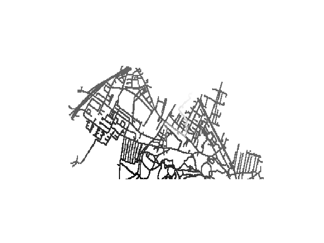

## Comparison between two human-like movementsgenerators based on environmental feature

Preference between total distance or attractiveness of the environment
The modification of the parameter alpha in Equation 5 in the paper is very important for the two A*
Its tweaking can change how the final trajectories look like.
The following pictures depict the raw  visualisation  of  how  the  Fitness and Feature Based  A*  explores  the  routing system.
Every section represent is constituted as follows:
- First and second figure show the f(n) value of the A* for the max and min alpha value respectively. The gradient of the colour respect the value of f(n). 
- third and fourth show the progression of the A* search for the max and min α value respectively. The gradient of the colour respect the time of the node visited.
The number after the name of the A* used means the same starting point is used to plot the grpahs

#### Fitness Based A* 0

|      |   |
| ---------------------------------------------- | ---------------------------------------- |
|  |   |

------

#### Feature Based A* 0 

|  |   |
| --------------------------------------- | ---------------------------------------- |
|  |   |

-----

#### Fitness Based A* 1

|  |   |
| --------------------------------------- | ---------------------------------------- |
|  |   |

------

#### Feature Based A* 1

|  |   |
| --------------------------------------- | ---------------------------------------- |
|  |   |

-----

#### Fitness Based A* 2

|  |   |
| --------------------------------------- | ---------------------------------------- |
|  |   |

------

#### Feature Based A* 2

|  |   |
| --------------------------------------- | ---------------------------------------- |
|  |   |

-----

#### Fitness Based A* 3

|  |   |
| --------------------------------------- | ---------------------------------------- |
|  |   |

------

#### Feature Based A* 3

|  |   |
| --------------------------------------- | ---------------------------------------- |
|  |   |

-----
#### Fitness Based A* 4

|  |   |
| --------------------------------------- | ---------------------------------------- |
|  |   |

------

#### Feature Based A* 4

|  |   |
| --------------------------------------- | ---------------------------------------- |
|  |   |

